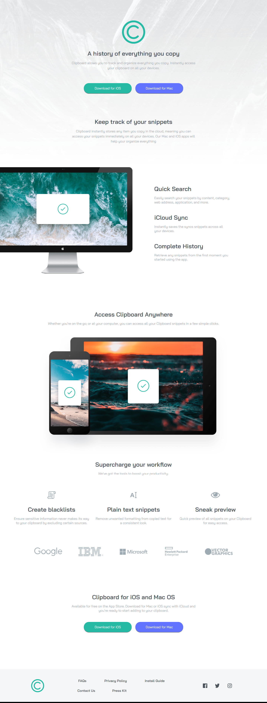
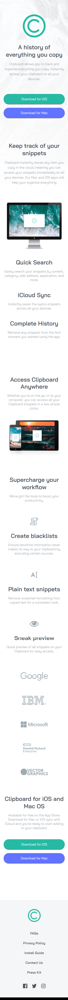

# Frontend Mentor - Clipboard landing page solution

This is a solution to the [Clipboard landing page challenge on Frontend Mentor](https://www.frontendmentor.io/challenges/clipboard-landing-page-5cc9bccd6c4c91111378ecb9). Frontend Mentor challenges help you improve your coding skills by building realistic projects.

### Screenshot

### Links

- Solution URL: [Repository](https://github.com/eyedent1ty/clipboard-landing-page)
- Live Site URL: [See Live](https://eyedent1ty-clipboard-landing-page.netlify.app)

### Built with

- Semantic HTML5 markup
- Flexbox
- Sass
- Mobile-first workflow
